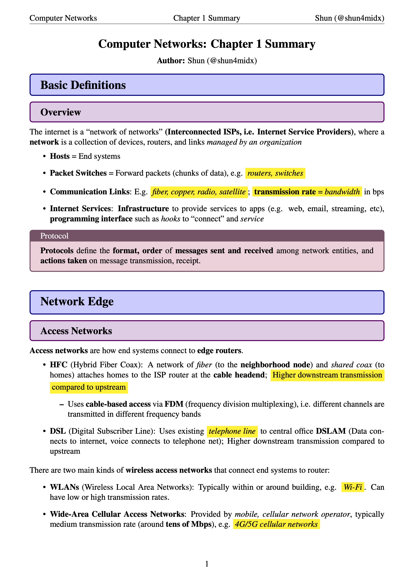
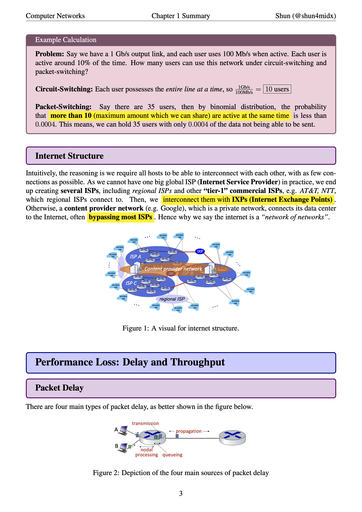

# CompNet-Notes
Shun's Public Notes for Computer Networks in Fall 2025

## Format
Within the folder `Summaries`, you will see my notes for each chapter, both as LaTeX and PDF files.

### Summaries
In `Summaries`, I have also attached my commonly used imports which I called in my LaTeX files, titled `shun4cmds.tex`, `shun4colors.tex`, and `shun4imports.tex`. If you want to modify my LaTeX files for your own note taking benefit, feel free to do so and credit me. Make sure you download my imports as well. If in the case I make any updates to these three files, I will NOT make any announcements, so it is your responsibility to use the most up-to-date files.

For each chapter, I will attach their chapter summary within the `Summaries` folder as `compnet_ch<chapter>.tex` and `compnet_ch<chapter>.pdf`.

In the case where the full chapter is not complete yet, I may sometimes upload a temporary file titled `[Part<part>]compnet_ch<chapter>` with the corresponding file extension. **These files will be removed once the full chapter is completed.**

### Condensed Midterm/Final Review
I will not upload any condensed review sheet, but will, for the convenience of your review, combine all tested chapter's summaries into one file for the corresponding exam. Additionally, upon viewing past exams, I'll include a section about test techniques and remarks at the back. This will constitute as what I will attach as the midterm/final review for this course.

## Color Schemes
It is not a secret I like the [Pink/Purple/Blue color scheme](https://github.com/shun4midx/Pink-Purple-Blue-VSCode-Theme). As a result, my more recent LaTeX files for notes all follow this aesthetic, typically with **blue boxes for headings**, **purple boxes for subheadings**, and **pink boxes for important concepts**. I also typically use yellow highlighter and very rarely green if there is too much yellow. 

If for some reason you do not like this color scheme, all boxes and highlights are drawn via commands in `shun4colors.tex`, so feel free to clone this repo and modify the colors in the commands yourself for personal use. On the other hand, if for some reason you like the color scheme I use, feel free to use my usual import files for personal use.

Here are two sample pages (one front page and one middle page) from `Summaries/compnet_ch1.pdf` with how my color scheme typically looks like:

  
  

## License
Licensed under the [MIT License](./LICENSE).